# Properties-of-MRI-k-space-and-parallel-imaging-
The aim of this repository is to get familiar with the properties of MRI k-space and parallel imaging. The task is to investigate different properties of k-space and their influence on image space by using only parts of k-space.

## Task 1

* During MRI data acquisition, the space covered by the phase and frequency encoding data is known as the k-space. The k-space and Image space are related by Fourier Transform.
* Here we are using multi-channel coils (number of coils = 2), to gain SNR, where each coil is independent. Each coil acquires the point of image which they were of most sensitive to.
* Each coil acquires the information independently and we can combine the images acquired by the different coils to get the final image.

**k-space of coil 1**     

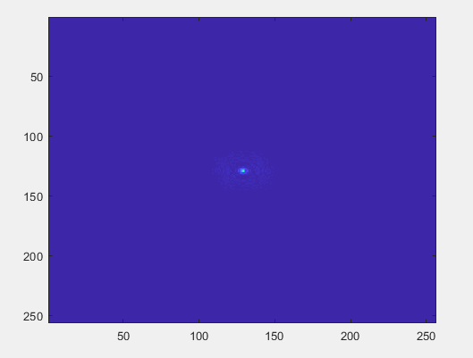 

**k-space of coil 2**

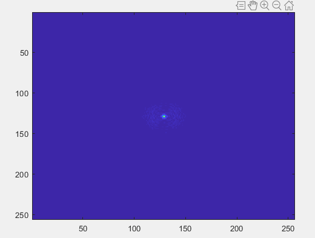

**Image reconstructed from k-space of coil 1**

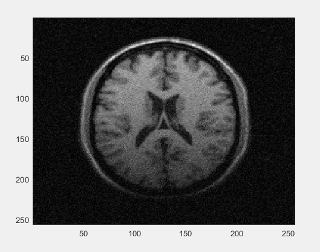 

**Image reconstructed from k-space of coil 2**

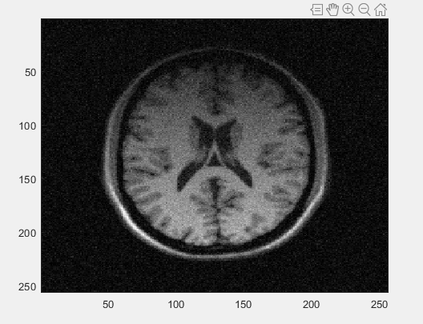

**Observations**

* The image acquied by coil 1 has lower contrast in the bottom as compared to the top region. Hence, it is darker in the bottom region because the coil 1 is placed closer to the top. Therefore, the coil is most sensitive to the area which is closer to it.
* Similarly, the image acquired by coil 2 has lower contrast in the top as compared to the bottom region. Hence, it is darker in the top region because the coil 2 is placed closer to the bottom region.

## Task 2

**Construct a composite image using the sum of squares (SoS) method**

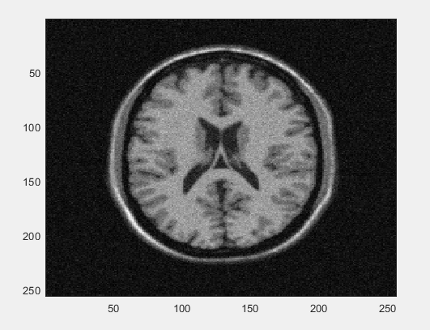

**Inference**

* Here we are combining the data acquired by the coil-1 and coil-2 to get the final image using SoS function.
* In Task 1 we acquired 2 images of the same anatomy using 2 different coils at 2 different positions.
* The part of the anatomy which is closest to coil-1 generated maximum information for that anatomy and less data for the anatomy far from it. A similar thing happens for coil-2.
* In Task 2 we combine those 2 images (in Task 1) to get the final image of the anatomy, which contains the complete information of the anatomy.

## Task 3

Our k-space is of dimension (256, 256, 2). The image space is reconstructed using Fourier Transform.

### [a] Remove half of k-space by replacing the most central half with zeros.

**Case 1 - By Replacing half of the central elements of the k-space with zeros i.e. Kn(64:192, 64:192, :) = 0**

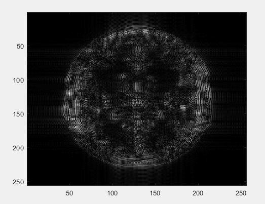

**Inference**
* Since the central parts of the k-space contains all the low-frequency components and also contains very high signals (high SNR), so by replacing most of the central parts of the k-space with 0, we were actually doing some kind of high pass filtering.
* When we reconstruct our image from this k-space then we have mostly high-frequency components in our image and most of the high-frequency components corresponding to noise. Hence, the image looks noisy.
* In other words, most of the signal contrast of the image corresponds to the central part of the k-space and replacing them with 0, which means we are decreasing the overall contrast of the image. Hence, the overall image is noist as well as reduced contrast.

**Case 2 - By Replacing some of the central elements of the k-space with zeros i.e. Kn(110:140, 110:140, :) = 0**

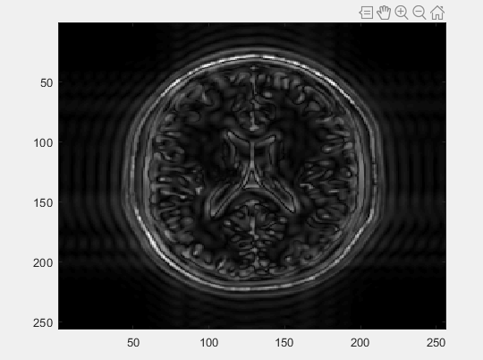

**Inference**
* A similar thing happens here as described above in case 1.
* Here, as we can see that the edges are more clear although the overall contrast is improved a little as compared to case 1. This is because we are replacing a smaller central region of k-space with 0, which means now we have comparatively more number of lower frequencies present, which means better contrast and SNR.

**Case 3 - By Replacing few of the central elements of the k-space with zeros i.e. Kn(120:130, 120:130, :) = 0**

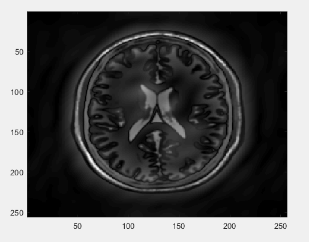

**Inference**
* Same things happens in here as well. But since we are replacing even a smaller central region of k-space with 0, so our overall contrast increased a lot as compared to the previous 2 cases. But still the overall SNR is lower than the actual image.
* And in all the above 3 cases the spatial resolution remains as it is.

### [b] Remove half of the k-space by removing the outermost half of k-space.

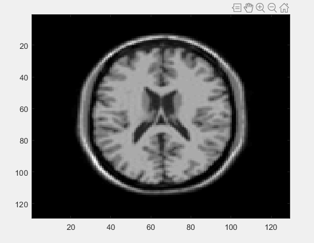

**Inference**
* Outermost parts of the k-space contains information about all the high-frequency components and also contains very low signals (low SNR), So by removing most of the outermost parts of the k-space, we are getting rid of high frequency components which results in getting rid of most of the noise in the image.
* But it also results in blurring of the final image because most of the high-frequency components correspond to the edges in the image. The omission of so many high spatial frequencies means that many edges and much of the fine detail will be lost.
* By removing outermost half of the k-space we are actually decreasing the spatial resolution by half of the image while increasing the SNR.

## Task 4

Our k-space is of dimension (256, 256, 2). The image space is reconstructed using Fourier Transform.

**[a] Remove half of k-space by removing the upper or lower half completely**

Here the final image is formed by removing the top half of k-space.

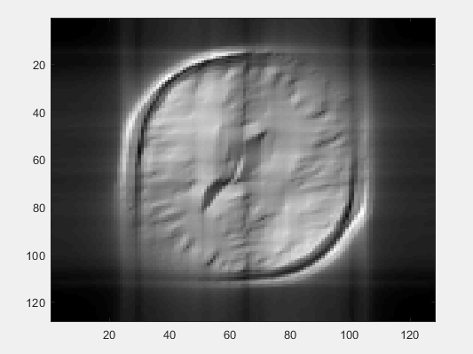

**Inference**
* We know that, each point in the k-space contains part of the information for the complete image. A point in the k-space does not corresponds to a specific point in the image space.
* So by removing the top half of the k-space we are basically throwing away 50% of the information. And since we are removing an entire half, we are actually removing some of the low frequency components as well as some of the high frequency components.
* Hence the overall spatial resolution as well as the SNR of the image decreases.

**[b] Remove half of k-space by removing every 2nd line in x-direction**

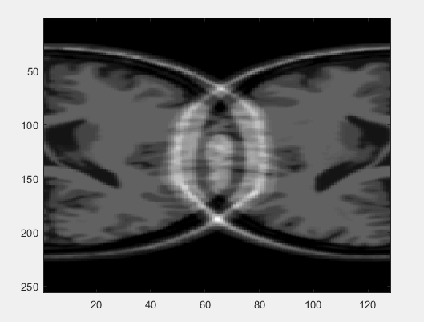

**Inference**
* By removing every 2nd line in the x-direction we are actually decreasing the spatial resolution along x-direction because while sampling the signal we are skipping some if the columns (frequency components) in the k-space.
* The other major problem with this is "Aliasing" artifact. In order to accurately reflect the continuous signal (along x-direction), we need to sample the signal rapidly enough such that all the main frequencies are present before taking the Fourier Transform. But here since we are skipping every 2nd line in x-direction, this is same as under-sampling the signal (slow sampling), which results in aliasing in the x-direction.

**[c] Remove half of the k-space by removing every 2nd line in y-direction**

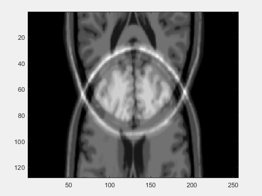

**Inference**
* By removing every 2nd line in the y-direction we are actually decreasing the spatial resolution along y-direction because while sampling the signal we are skipping some of the rows in the k-space.
* The other major proAblem with this is "Aliasing" artifact. By skipping every 2nd line in the y-direction of the k-space, we are actually removing most of the frequencies i.e. undersampling and hence after taking the Fourier transform we are having htis kind of artifact.
* This also decreases the Field of View (FOV) of the image space.

## Task 5
Let's see what happens to the images when we under-sample our k-space data.

**Aliasing due to coil 1 and coil 2**

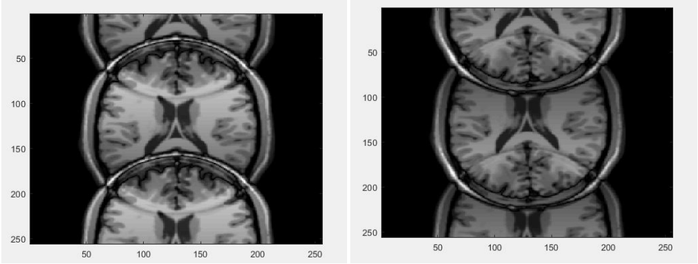

* As described above, when we undersample our k-space data, there will be artifacts such as aliasing. So that we can no longer unambiguously separate out the top and bottom portions of the brain. This is because we have thrown out half of our measurements. Parallel Imaging technique like SENSE can be used to overcome this problem.
* Parallel Imaging using SENSE:
	  **C = S * M**

	where, C - Image from Coil 'i'
	       S - Sensitivity of Coil 'i'
	       M - underlying sample magnetization

